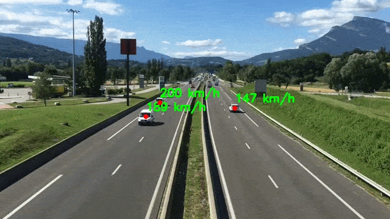
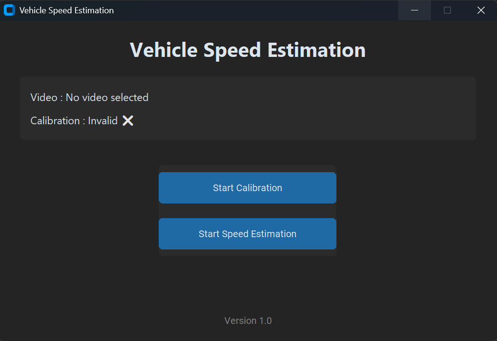
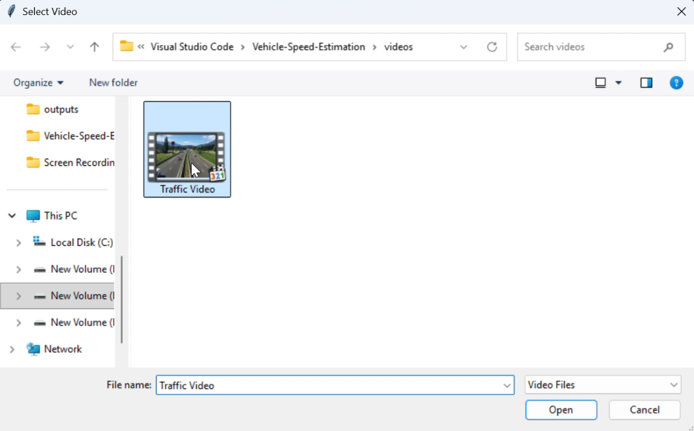
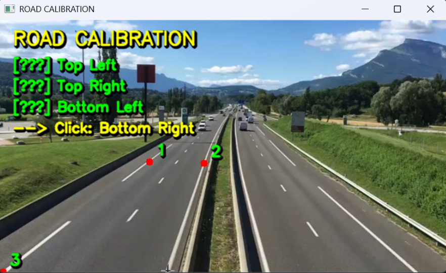
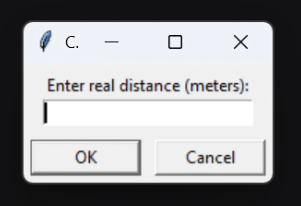
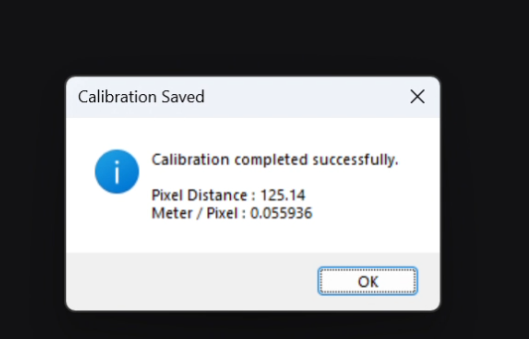
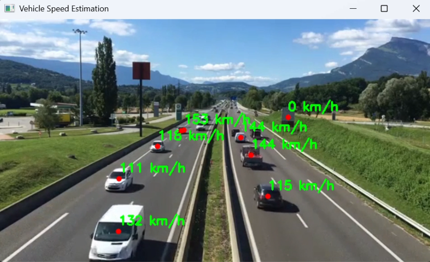
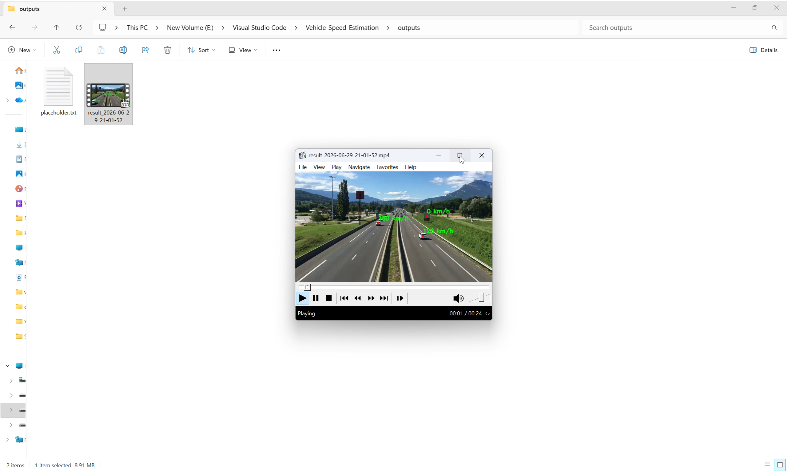

# 🚗 Vehicle Speed Estimation using YOLOv8


An interactive Computer Vision application for estimating vehicle speed from traffic videos using **YOLOv8**, **OpenCV**, and **PyTorch**.

<p align="center">
  
</p>

---

# 📑 Table of Contents

* [Project Overview](#-project-overview)
* [Demo](#-demo)
* [Features](#-features)
* [Installation](#-installation)
* [Running the Project](#-running-the-project)
* [Methodology](#-methodology)
* [Calibration Guide](#-calibration-guide)
* [Calibration Assumptions](#-calibration-assumptions)
* [Screenshots](#-screenshots)
* [Project Structure](#-project-structure)
* [Technologies Used](#-technologies-used)
* [Limitations](#-limitations)
* [Future Improvements](#-future-improvements)
* [Author](#-author)

---

# 📖 Project Overview

This project estimates vehicle speed from traffic videos captured by a **single monocular camera** using modern Computer Vision techniques.

Instead of relying on hardcoded calibration values, the application provides an **interactive calibration workflow** that allows the user to define the road region and calibrate the scene before estimating vehicle speeds.

The project was developed to demonstrate practical Computer Vision techniques for vehicle speed estimation through an interactive and user-friendly workflow, while aiming to provide reliable speed estimates under real-world conditions.

The application combines:

* YOLOv8 for vehicle detection.
* OpenCV for video processing and visualization.
* CustomTkinter for the graphical user interface.

---

# 🎥 Demo

A demonstration video is included in:

```text
assets/0_vehicle_speed_estimation_demo.mp4
```

The repository also contains sample traffic videos inside the **videos/** directory, allowing users to test the application immediately after installation.

---

# ✨ Features

* Interactive graphical user interface (GUI).
* Video selection through a file browser.
* Interactive road calibration.
* Distance calibration using real-world measurements.
* Vehicle detection using YOLOv8.
* Vehicle tracking.
* Vehicle speed estimation.
* Automatic calibration saving.
* Automatic processed video generation.
* Configuration storage using JSON.
* Easy-to-use workflow.
* GPU acceleration through CUDA-enabled PyTorch (optional).

---

# ⚙️ Installation

## 1. Clone the repository

```bash
git clone https://github.com/Ahmed-Alquwaie/Vehicle-Speed-Estimation.git

cd Vehicle-Speed-Estimation
```

---

## 2. Create a virtual environment

```bash
python -m venv venv
```

---

## 3. Activate the virtual environment

### Windows

```bash
venv\Scripts\activate
```

### Linux / macOS

```bash
source venv/bin/activate
```

---

## 4. Install project dependencies

```bash
pip install -r requirements.txt
```

---

## 5. Install CUDA-enabled PyTorch (Recommended)

For NVIDIA GPUs:

```bash
pip install torch torchvision torchaudio --index-url https://download.pytorch.org/whl/cu121
```

> Although the project was developed using CUDA-enabled PyTorch, it can also run on the CPU if CUDA is unavailable. However, GPU acceleration is strongly recommended for significantly faster inference.

---

## 6. Verify GPU Support (Optional)

```python
import torch

print(torch.cuda.is_available())
print(torch.cuda.get_device_name(0))
```

Expected output:

```text
True
NVIDIA GeForce RTX ...
```

---

# 🚀 Running the Project

Launch the application:

```bash
python launcher.py
```

The launcher provides two options:

* **Start Calibration**
* **Start Speed Estimation**

The calibration only needs to be repeated when using a different video or camera setup.

---

# 🧠 Methodology

The speed estimation pipeline follows these steps:

1. Select the input traffic video.
2. Define the road region using four calibration points.
3. Select two points with a known real-world distance.
4. Compute the pixel-to-meter conversion factor.
5. Detect vehicles using YOLOv8.
6. Track vehicle positions across consecutive frames.
7. Measure pixel displacement.
8. Convert displacement into real-world distance.
9. Estimate vehicle speed.
10. Display the estimated speed and save the processed output video automatically.

                                    Video
                                      ↓

                                 Calibration
                                      ↓

                                YOLO Detection
                                      ↓

                                   Tracking 
                                      ↓

                                Pixel Displacement
                                      ↓

                                Speed Estimation
                                      ↓
                                      
                                 Output Video

This workflow keeps the application flexible while avoiding hardcoded calibration values.

---

# 📐 Calibration Guide

For the best estimation accuracy:

* Select the road boundaries carefully using the four calibration points.
* Choose the distance calibration points **inside the selected road region**.
* Always perform the distance measurement in the **closest visible part of the road** to the camera.
* Avoid measuring distances near the horizon due to perspective distortion.
* Use a straight road section whenever possible.
* Enter the real-world distance accurately.
* Recalibrate whenever the camera position or the input video changes.

Proper calibration has the greatest impact on the final speed estimation accuracy.

---

# 📏 Calibration Assumptions

The application requires a real-world measurement during calibration.

Whenever the exact road dimensions are unknown, the total road width may be estimated using the number of traffic lanes.

A standard lane width of approximately **3.5 meters** was used as a practical reference because it is commonly adopted in many road design standards.

However, lane widths vary depending on:

* Country
* Road classification
* Local design regulations

Whenever actual road measurements are available, they should always be preferred over estimated values.

---

# 📸 Screenshots

## Launcher

<p align="center">
  
</p>

The application starts from a simple graphical interface that allows the user to either calibrate a new video or start the speed estimation process using an existing calibration.

---

## Video Selection

<p align="center">
  
</p>

The user selects the input traffic video through the file browser.

---

## Road Calibration

<p align="center">
  
</p>

The four corner points define the road region used during the calibration process.

---

## Distance Calibration

<p align="center">
  
</p>

Two points with a known real-world distance are selected.

---

## Real Distance Input

<p align="center">
  
</p>

The user enters the corresponding real-world distance in meters.

---

## Calibration Result

<p align="center">
  
</p>

The application computes and stores the pixel-to-meter conversion factor automatically.

---

## Speed Estimation

<p align="center">
  
</p>

Vehicle speeds are estimated and displayed directly on the processed video.

---

## Output Video

<p align="center">
  
</p>

The processed video is automatically saved inside the **outputs/** directory.

---

# 📂 Project Structure

```text
Vehicle-Speed-Estimation/
│
├── assets/
│   ├── vehicle_speed_estimation_demo.mp4
│   ├── 1_launcher_window.png
│   ├── ...
│
├── configs/
│   └── calibration.json
│
├── models/
|   ├── yolov8s.pt
│   └── yolov8n.pt
│
├── outputs/
│
├── videos/
│
├── calibration.py
├── launcher.py
├── speed_estimation.py
├── requirements.txt
├── .gitignore
└── README.md
```

---

# 🛠️ Technologies Used

| Technology    | Purpose                                                                            |
| ------------- | ---------------------------------------------------------------------------------- |
| Python        | Core programming language                                                          |
| YOLOv8        | Vehicle detection                                                                  |
| OpenCV        | Video processing, calibration, visualization, drawing, and output video generation |
| CustomTkinter | Graphical User Interface                                                           |
| NumPy         | Numerical operations                                                               |

---

# ⚠️ Limitations

This project estimates vehicle speed using a **single monocular camera** and a **manual calibration process**.

The estimated speeds should be interpreted as **approximations** that depend on the calibration quality and recording conditions rather than legally certified measurements.

The estimation accuracy is affected by several factors, including:

* Calibration point selection.
* Camera perspective.
* Video resolution.
* Camera stability.
* Vehicle occlusion.
* Tracking performance.
* Real-world road measurements.

When the actual road dimensions are unknown, estimating the road width using a standard lane width (approximately **3.5 meters per lane**) provides practical results. However, because lane widths vary between countries and road types, this assumption introduces a small estimation error.

Despite these limitations, the project provides consistent and reliable speed estimates for educational, demonstration, and portfolio purposes.

---

# 🚀 Future Improvements

Possible future enhancements include:

* Bird's-eye-view transformation (Perspective Transformation).
* Automatic camera calibration.
* Automatic road width estimation.
* Lane detection.
* Region of Interest (ROI) selection.
* Average vehicle speed calculation.
* CSV export of speed measurements.
* Improved tracking for crowded traffic scenes.
* Real-time webcam support.
* Multi-camera support.
* Advanced calibration using camera intrinsic parameters.

---

# 👤 Author

**Ahmed Alquwaie**


